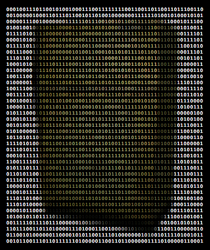

# freezer

## Machine-readable support dumps

Capture everything that the docker api will give you, and then save it to a file for further analysis. This captures raw API responses from the docker daemon that can be referred to later

    docker run --rm -it -v /var/run/docker.sock:/var/run/docker.sock \
        programmerq/freezer > myfreeze.tar

## "Unfreezing"

The `programmerq/freezer:unfreeze` image is an nginx image configured to serve up the untarred results in a way suitable for consumption by a normal docker client:

    mkdir unfreeze && cd && tar -zxvf ../myfreeze.tar
    docker run -d --name unfreeze -v $(pwd):/usr/share/nginx/html -p 2375:80 \
        programmerq/freezer:unfreeze
    docker -H tcp://127.0.0.1:2375 ps
